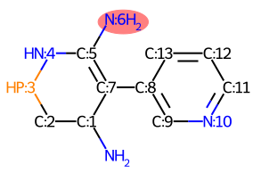
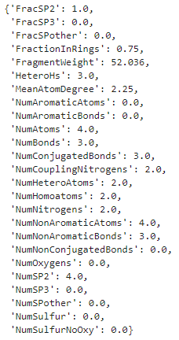

## RDKit-mol-reactive-site-features
RDKit based code to calculate local molecule features around a reactive site of a molecule. For instance for creating reaction descriptors.

## Required packages
rdkit 2021.03.5 \
numpy 1.20.3

## Usage

```python
from ReactiveSiteFeatures import Local_FromSmiles

smi = 'NC1CPNC(N)=C1C1=CN=CC=C1'
idx = 6
results = Local_FromSmiles(smiles=smi, index=idx, radius=2)
```
